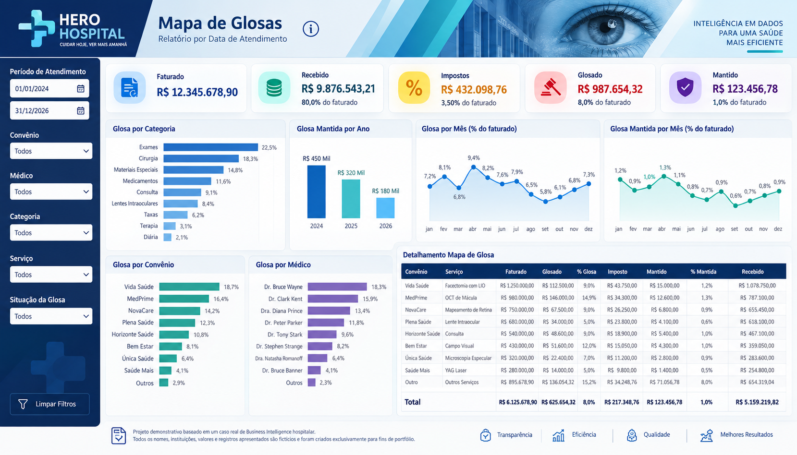

# Portfólio | Análise de Sistemas, Dados e Business Intelligence

**Dados, processos e tecnologia para apoiar decisões na saúde.**

**Michel da S. Carvalho**

Sou Analista de Sistemas e Dados, com experiência em Power BI, SQL, Oracle, Power Query e DAX, além de atuação com análise de requisitos, processos, ERP Hospitalar e gestão de projetos.

Meu trabalho conecta as necessidades do negócio às estruturas dos sistemas que produzem a informação: entender o processo, traduzir regras, integrar dados e apresentar indicadores que possam ser investigados em detalhe.

## Projeto em destaque — Mapa de Glosas

Este repositório reúne meus projetos baseado em caso reais, porém com dados demonstrativos de dados e Business Intelligence. Cada demo possui uma pasta própria com contexto, tecnologias, imagens e documentação.

| Demo | Tema | Tecnologias | Material |
| --- | --- | --- | --- |
| [01 · Mapa de Glosas Hospitalares](projetos/01-mapa-de-glosas/README.md) | Faturamento e análise de glosas na saúde | Oracle SQL, Power BI, Power Query e DAX | Case e dashboard demonstrativo |

[Índice dos projetos](projetos/README.md)

Uma necessidade da gestão do Faturamento deu origem a uma solução para reunir informações de atendimento, faturamento e movimentação financeira. O projeto conecta uma base analítica em Oracle SQL ao Power BI para acompanhar faturamento, glosas, impostos e recebimentos.

*Imagem demonstrativa com nomes e valores fictícios. Cartões e tabela não constituem um conjunto financeiro conciliado; os números não representam resultados reais do projeto.*

**[Conheça a história completa do projeto →](projetos/01-mapa-de-glosas/README.md)**

[Veja meu conhecimento aplicado em cada etapa: requisitos, SQL, Power Query, DAX e validação](projetos/01-mapa-de-glosas/ETAPAS-DO-PROJETO.md).

O case apresenta a necessidade do negócio, minha participação, a arquitetura, os desafios de granularidade e a leitura dos indicadores. A solução demonstra como transformar informações distribuídas no ERP em uma visão que conecta resumo e detalhamento.

## Como trabalho

1. **Entender a necessidade:** identificar perguntas e regras de negócio.
2. **Investigar os sistemas:** compreender origens, relacionamentos e níveis de detalhe.
3. **Preparar a base:** integrar informações com atenção às chaves e aos cálculos financeiros.
4. **Construir a análise:** organizar indicadores e detalhamento no Power BI.
5. **Validar a interpretação:** confrontar a leitura com as necessidades do setor e explicitar limites.

## Tecnologias e competências

| Recurso | Aplicação |
| --- | --- |
| Oracle SQL | CTEs, junções, agregações e cálculos financeiros |
| Power BI | Modelagem analítica, indicadores e dashboards |
| Power Query e DAX | Preparação dos dados e camada de análise |
| ERP Hospitalar | Entendimento das origens e dos processos da saúde |
| Análise de negócios e sistemas | Requisitos e tradução de regras de negócio |
| Gestão de projetos | Organização e acompanhamento de entregas |

## Materiais públicos

Este portfólio apresenta um case baseado em experiência real e uma imagem demonstrativa fictícia. Não inclui dados operacionais, conexões, a consulta original ou um relatório Power BI executável. Ganhos financeiros e percentuais de melhoria não são atribuídos ao projeto sem evidências.

[Texto de apresentação para divulgação](DIVULGACAO.md)
