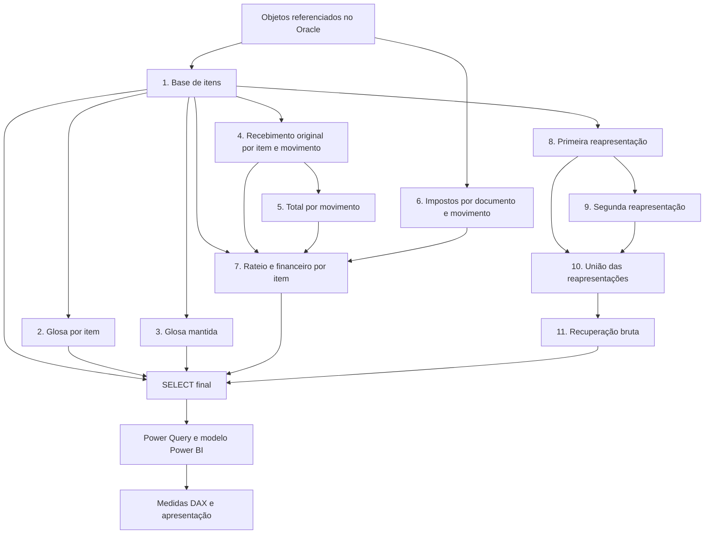

# Da regra de negócio ao dashboard: decisões em cada etapa

**Michel da S. Carvalho · Analista de Sistemas e Dados**

[← Voltar ao case](README.md)

[História e requisitos registrados no formulário](HISTORIA-DO-PROJETO.md): público por função, perguntas de negócio, mudanças de escopo, rotina de atualização e situação da homologação.

Esta descrição foi elaborada a partir da consulta SQL e dos metadados de Power Query e DAX disponíveis para análise. Os nomes técnicos abaixo são descrições conceituais. Não são reproduzidos nomes de objetos internos, códigos operacionais, endereços de conexão, documentos, dados pessoais ou a identidade da empresa. Participantes do negócio são mencionados somente por função; não são atribuídos cargos específicos sem comprovação.

## 1. Entendimento da necessidade e tradução dos requisitos

O ponto de partida foi uma necessidade da gestão do Faturamento: acompanhar glosas e relacionar seus valores ao faturamento e aos recebimentos. Minha atuação conectou o entendimento do processo à construção de uma base analítica e à apresentação das informações no Power BI.

A definição dos indicadores exige distinguir o que foi faturado, o que foi glosado, qual parcela foi mantida e o que foi recebido. Também exige definir a data de referência e separar recebimentos originais dos valores associados às reapresentações.

**Conhecimento demonstrado:** análise de requisitos, interpretação de processos hospitalares e tradução de conceitos financeiros em regras de cálculo. O levantamento não se resume à escolha de gráficos: ele orienta quais relações e critérios precisam existir na base.

## 2. Mapeamento das fontes e definição do detalhe

A consulta referencia **12 objetos do banco Oracle**, organizando informações de atendimento, itens, faturamento, documentos e movimentações financeiras, além de classificações utilizadas na análise.

“Objeto referenciado” não significa necessariamente tabela física. O texto SQL, isoladamente, não distingue todas as referências entre tabelas, views e sinônimos. Também não permite concluir quantas tabelas subjacentes existem por trás de uma view.

A granularidade pretendida do resultado é **um item de atendimento**. Atendimento, item, documento e movimento financeiro são níveis distintos. Definir esse detalhe permite decidir onde agregar valores e como retorná-los à base final.

**Conhecimento demonstrado:** leitura de estruturas relacionais, chaves compostas, cardinalidade e modelagem analítica. Contar linhas de itens não equivale a contar atendimentos ou contas.

## 3. Organização da consulta

> A solução integra 12 objetos referenciados no banco Oracle e organiza o tratamento em 11 CTEs, com 25 operações de JOIN, consolidando informações de faturamento, glosas, recebimentos, impostos e reapresentações em uma base analítica para o Power BI.

As CTEs são **blocos lógicos da mesma instrução SQL**. Os JOINs estão distribuídos entre esses blocos e o SELECT final; não constituem uma etapa isolada anterior às CTEs. O desenho abaixo representa dependências lógicas, sem afirmar uma ordem física de execução.



### CTE 1 — Base dos itens faturados

**Finalidade:** estabelecer quais itens entram na análise e reunir seus atributos de contexto. A consulta associa atendimento, item, faturamento e classificações com chaves compostas e aplica os critérios de elegibilidade do negócio.

**Decisão técnica:** o faturado é calculado com tratamento de valores ausentes e uma regra condicional. Os filtros delimitam o universo analisado; não devem ser interpretados como uma representação irrestrita de todo o ERP.

**Conhecimento demonstrado:** uso de `INNER JOIN`, `CASE`, `NVL` e tratamento de datas. É necessário conferir se as associações obrigatórias excluem itens sem correspondência e se as chaves mantêm a granularidade desejada.

### CTE 2 — Glosa por item

**Finalidade:** retornar um valor de glosa para cada item da base.

**Decisão técnica:** a implementação utiliza `MAX` após tratar valores ausentes e agrupa pela chave do item. Isso seleciona o maior valor encontrado no grupo; não equivale a somar movimentos nem a selecionar automaticamente o registro mais recente.

**Conhecimento demonstrado:** escolher a agregação conforme a semântica do indicador. A existência de `MAX` não é prova de deduplicação ou conciliação funcional; sua adequação depende da regra de negócio.

### CTE 3 — Glosa mantida por item

**Finalidade:** separar o valor de glosa acatada do valor glosado.

**Decisão técnica:** relacionar os registros do item aos movimentos, aplicar critérios de tipo e liberação e somar o valor elegível por item. Os códigos internos usados nessa seleção permanecem privados.

**Conhecimento demonstrado:** filtros de negócio associados ao estado do movimento, agregação condicional por seleção de registros e distinção entre indicadores financeiramente diferentes.

### CTE 4 — Recebimento original por item e movimento

**Finalidade:** identificar recebimentos vinculados ao documento original do item.

**Decisão técnica:** conferir a identidade do documento, além das chaves do item e do movimento. Essa associação separa o caminho do recebimento original do caminho de reapresentação.

O resultado intermediário tem granularidade **item + movimento de recebimento**, porque um item pode participar de mais de um movimento.

**Conhecimento demonstrado:** rastreabilidade documental e preservação do detalhe necessário ao rateio posterior, evitando associar um recebimento apenas pela coincidência do item.

### CTE 5 — Total do movimento de recebimento

**Finalidade:** construir o denominador do rateio de imposto.

**Decisão técnica:** somar os recebimentos brutos da etapa anterior por movimento. Esse total considera o universo de itens que passou pelos critérios da base; não é automaticamente o total irrestrito do documento no sistema.

**Conhecimento demonstrado:** mudança controlada de granularidade e definição consistente do universo de cálculo. A conciliação precisa confirmar que a base do rateio corresponde à base do imposto.

### CTE 6 — Impostos associados ao recebimento

**Finalidade:** apurar o imposto que será distribuído aos itens.

**Decisão técnica:** selecionar os tipos de movimento de imposto previstos e agregar por documento e movimento de recebimento de origem. O vínculo ao movimento original é tão importante quanto o valor a distribuir.

**Conhecimento demonstrado:** relações entre movimentos, agrupamento por múltiplas chaves e separação entre apuração do imposto e sua distribuição analítica.

### CTE 7 — Rateio e financeiro por item

**Finalidade:** atribuir imposto aos itens e calcular o recebimento líquido.

**Decisão técnica:** combinar recebimento por item, total do movimento e imposto correspondente. A regra conceitual é:

```text
Participação do item = recebimento bruto do item / total do movimento
Imposto do item = imposto do movimento × participação do item
Recebimento líquido do item = recebimento bruto do item − imposto do item
```

A implementação trata denominador zero, admite ausência de imposto e agrega os resultados novamente por item. O tratamento de zero evita a divisão inválida, mas não resolve sozinho uma inconsistência de origem.

**Conhecimento demonstrado:** rateio proporcional, aritmética financeira, tratamento de nulos e retorno à granularidade final. A validação deve considerar diferenças de arredondamento e a correspondência entre as bases do numerador e denominador.

### CTE 8 — Primeira reapresentação

**Finalidade:** localizar documentos de reapresentação associados ao documento original.

**Decisão técnica:** seguir a referência de origem do documento e manter a relação entre item e documento encontrado. O `DISTINCT` remove repetições idênticas nas colunas selecionadas nessa etapa.

**Conhecimento demonstrado:** navegação em relações de origem e uso localizado de eliminação de repetições. `DISTINCT` não garante a unicidade de toda a cadeia financeira.

### CTE 9 — Segunda reapresentação

**Finalidade:** identificar uma reapresentação cujo documento de origem pertença ao primeiro nível.

**Decisão técnica:** repetir o vínculo de origem a partir do resultado anterior, preservando a referência ao item.

**Conhecimento demonstrado:** tratamento de encadeamento documental com profundidade explícita. A consulta cobre dois níveis; não implementa uma busca recursiva de profundidade ilimitada.

### CTE 10 — Consolidação das reapresentações

**Finalidade:** reunir os documentos identificados nos dois níveis.

**Decisão técnica:** utilizar `UNION ALL`, que preserva as linhas de ambas as origens. Mesmo com `DISTINCT` em cada nível, repetições entre os conjuntos podem permanecer.

**Conhecimento demonstrado:** distinção entre combinar conjuntos e remover duplicidades. A escolha requer conferir sobreposição entre os níveis antes de interpretar somas posteriores.

### CTE 11 — Recuperação bruta por item

**Finalidade:** apurar valores recebidos associados aos documentos de reapresentação.

**Decisão técnica:** relacionar os documentos consolidados aos movimentos e ao detalhe do item, aplicar o filtro previsto e somar o valor bruto por item.

**Conhecimento demonstrado:** rastreabilidade entre documento, movimento e item, além da distinção entre recebimento original líquido e recuperação bruta. O filtro implementado e a conciliação dos valores precisam de validação funcional; essa etapa permanece explicitamente pendente.

### SELECT final — Uma base para consumo analítico

O SELECT final parte da base de itens e associa quatro resultados agregados por meio de `LEFT JOIN`: glosa, glosa mantida, financeiro e recuperação. Aplica tratamento de ausências e arredondamento monetário.

Essas junções preservam os itens sem um resultado financeiro correspondente. Para manter uma linha por item, a base e os resultados associados precisam respeitar suas chaves. A forma da consulta não substitui a verificação de unicidade.

**Conhecimento demonstrado:** consolidação de métricas com granularidade compatível, preservação da população analisada e preparação de uma interface de dados para o BI.

## 4. Power Query — Consumo da consulta Oracle

O código M disponível utiliza o conector Oracle com uma consulta SQL nativa e retorna o resultado dessa fonte. Nessa versão inspecionada, não foram identificadas etapas adicionais de transformação M após a consulta.

Isso permite explicar a distribuição de responsabilidades: a integração e os cálculos financeiros estão na SQL; o Power Query realiza a conexão e entrega o resultado ao modelo. Não são alegados processos de limpeza em M que não aparecem no arquivo analisado. Os parâmetros de conexão permanecem confidenciais.

**Conhecimento demonstrado:** integração entre banco e ferramenta de BI e compreensão de onde cada transformação efetivamente acontece.

## 5. Modelagem temporal e categorias

Os metadados incluem uma tabela calendário calculada com atributos de ano, mês, trimestre e dia da semana. Sua expressão usa uma janela móvel de dez anos baseada na data corrente de avaliação. A cobertura do calendário deve ser confrontada com as datas da base, sem presumir que todo o histórico esteja coberto.

Também foi identificada uma coluna calculada que traduz códigos de categoria em descrições de negócio e utiliza uma classificação residual para valores não mapeados. Os códigos internos não são publicados.

**Conhecimento demonstrado:** organização da leitura temporal e tradução de classificações técnicas em linguagem de negócio. A data de atendimento não deve ser apresentada como data do recebimento. Não se presume um modelo estrela completo ou a configuração dos relacionamentos apenas pela existência do calendário.

## 6. DAX — Valores e percentuais

Foram identificadas nove medidas explícitas: cinco somas de valores financeiros e quatro razões sobre o faturamento. As expressões usam `SUM` para faturado, recebido, imposto, glosado e mantido, e `DIVIDE` para os respectivos percentuais de recebido, imposto, glosa e glosa mantida.

Os percentuais são calculados pela razão entre totais no contexto de filtro, em vez da média dos percentuais dos itens. Isso mantém a ponderação pelos valores envolvidos. A implementação inspecionada não informa um resultado alternativo em `DIVIDE`.

**Conhecimento demonstrado:** medidas reutilizáveis, contexto de filtro e escolha de denominadores. Uma medida existente não comprova, sozinha, que cada visual a utiliza corretamente.

[Veja as definições e exemplos DAX com nomes genéricos](dax/medidas.md).

## 7. Apresentação e comunicação com o negócio

A proposta visual organiza cartões de indicadores, distribuições por dimensões, evolução temporal e detalhamento. Essa composição permite iniciar pelas perguntas gerais e avançar para a investigação da composição dos valores.

**Conhecimento demonstrado:** hierarquia da informação, ligação entre resumo e detalhe e explicação dos indicadores para a gestão do Faturamento. A imagem pública é fictícia e ilustrativa; não comprova interações do relatório nem resultados financeiros.

## 8. Validação e limites das evidências

| Verificação | O que precisa demonstrar |
| --- | --- |
| Unicidade | Uma linha por chave na granularidade esperada |
| Cardinalidade | Junções não multiplicam os resultados agregados |
| Conciliação | Totais correspondem às regras e ao universo do cálculo |
| Rateio | Distribuição do imposto compatível com o recebimento utilizado |
| Reapresentações | Ausência de contagem indevida entre os níveis |
| Calendário | Cobertura das datas e propagação correta dos filtros |
| DAX e visuais | Totais e percentuais coerentes no contexto selecionado |

Esta tabela descreve critérios de validação. O formulário recebido registra faturamento, glosa, glosa mantida, recebimento e imposto como validados e em acompanhamento, além da conferência da chave sem duplicidade na base avaliada. A recuperação permanece pendente, e o projeto está em homologação. Esses registros documentais não representam uma nova execução de testes nesta revisão. Não são divulgados volumes, valores ou identificadores operacionais reais.

## Como apresentar minha contribuição em uma entrevista

> “Parti de uma necessidade da gestão do Faturamento e traduzi as regras em uma base analítica por item de atendimento. Organizei a consulta em 11 CTEs, separando a formação da base, glosas, recebimentos, rateio de impostos e dois níveis de reapresentação. Meu cuidado central foi respeitar a granularidade, manter a rastreabilidade dos documentos e distinguir recebimento líquido de recuperação bruta. No Power BI, conectei essa base aos indicadores e à leitura por período e categorias. A recuperação ainda exige validação funcional, e o material público preserva a confidencialidade da organização.”
