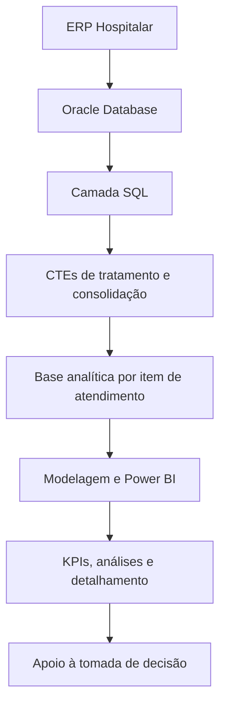
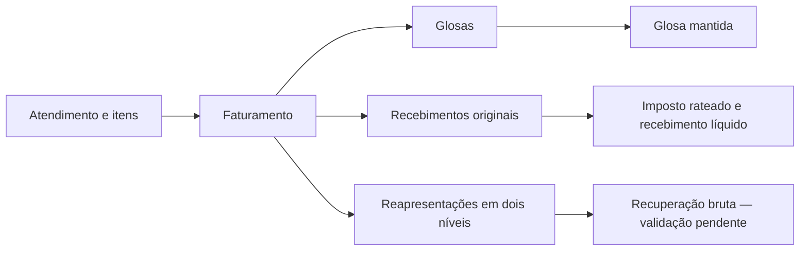

# Mapa de Glosas e Faturamento Hospitalar

**Da necessidade do Faturamento à análise de indicadores e registros no Power BI.**

**Autor: Michel da S. Carvalho**

[← Voltar ao portfólio](../../README.md)

## Sobre o projeto

O **Mapa de Glosas** é um projeto real de Análise de Dados e Business Intelligence desenvolvido na área hospitalar. Surgiu de uma necessidade da gestão do Faturamento para melhorar o acompanhamento das glosas e centralizar informações distribuídas entre diferentes estruturas do ERP.

A solução reúne uma camada Oracle SQL de integração e cálculo financeiro com a análise no Power BI. O dashboard permite partir de uma visão sintética dos indicadores e chegar ao detalhamento necessário para investigar os registros e apoiar decisões do setor.

## Problema de negócio

As informações importantes para acompanhar as glosas estavam distribuídas entre estruturas de atendimento, faturamento e movimentação financeira. Transformá-las em uma visão analítica exigia compreender suas relações, interpretar as regras de negócio e compatibilizar diferentes níveis de detalhe.

O desafio era construir uma base que permitisse analisar os valores e investigar sua composição, mantendo a relação entre os indicadores e os itens de atendimento.

## Objetivo

Centralizar o acompanhamento de faturamento, glosas e recebimentos em uma base analítica por item de atendimento, disponibilizando indicadores e detalhamento no Power BI.

O valor para o negócio está em facilitar o acompanhamento das glosas e a investigação dos registros pelo Faturamento. Resultados quantitativos de melhoria, economia ou produtividade não são apresentados neste case.

## Minha participação

Fui responsável pelo entendimento da necessidade junto à área de negócio e pela tradução das regras do setor em uma solução analítica. Minha atuação abrangeu:

- Levantamento e tradução das regras de negócio.
- Desenvolvimento e evolução das consultas Oracle SQL.
- Tratamento e validação dos dados.
- Modelagem analítica e criação dos indicadores.
- Desenvolvimento do dashboard no Power BI.
- Validação dos resultados em relação à necessidade do setor.

Esse trabalho conectou o entendimento do processo hospitalar à preparação dos dados e à apresentação das informações para análise. A recuperação bruta, embora implementada na SQL, permanece pendente de validação funcional.

## O projeto em números

| SELECTs | CTEs | Objetos de banco integrados | JOINs | UNION ALL |
| :---: | :---: | :---: | :---: | :---: |
| **13** | **11** | **12** | **25** | **1** |

Esses números representam a complexidade da integração SQL que sustenta a camada analítica.

São **19 INNER JOINs e 6 LEFT JOINs**, distribuídos em **12 blocos principais**: 11 CTEs e a consulta final. Uma CTE contém dois SELECTs conectados por UNION ALL; não há UNION simples. As contagens incluem relações entre CTEs, sem contar aliases como objetos diferentes.

O termo “objetos de banco” é utilizado porque o texto SQL não permite distinguir, para todas as referências, tabelas, views ou sinônimos. Essas métricas descrevem a estrutura da solução, não seu desempenho ou impacto financeiro.

## Arquitetura da solução

Os dados vêm do ERP Hospitalar, em ambiente Oracle. A camada SQL utiliza CTEs para organizar a base de itens, calcular valores financeiros e integrar os resultados antes do consumo no Power BI.

A integração financeira é realizada na SQL. O modelo e as medidas do Power BI complementam o consumo analítico da base; suas configurações específicas ainda precisam ser documentadas.

## Fluxo analítico

A solução conecta o atendimento ao faturamento e permite analisar glosas, recebimentos e reapresentações. O diagrama representa caminhos de análise, **não uma sequência operacional obrigatória para todos os registros**.

A construção do case seguiu o percurso: necessidade do Faturamento, entendimento das regras, análise das estruturas do ERP, desenvolvimento SQL, integração e tratamento, base analítica, modelagem, indicadores e detalhamento no Power BI.

## Indicadores

Os cinco indicadores abaixo possuem cálculos confirmados na consulta analisada. Essa confirmação demonstra sua implementação na SQL; a conciliação funcional depende das regras e evidências de validação do projeto.

| Indicador | O que a camada SQL entrega |
| --- | --- |
| **Valor Faturado** | Valor por item, considerando as regras de elegibilidade da base |
| **Valor Glosado** | Valor de glosa apurado por item |
| **Glosa Mantida** | Valor agregado de glosas acatadas conforme as condições de movimentação |
| **Recebimento líquido de imposto** | Recebimento original após a dedução do imposto atribuído ao item |
| **Imposto rateado proporcionalmente** | Parcela do imposto distribuída conforme a participação do item no recebimento |

**Recuperação bruta:** implementada na camada SQL e pendente de validação funcional. Considera recebimentos associados às reapresentações; não é apresentada como indicador definitivamente validado.

### Análises complementares no Power BI

| Análise / medida | Situação da documentação |
| --- | --- |
| % de Glosa | Não calculado na SQL; implementação e definição da medida precisam ser verificadas no Power BI/DAX |
| % de Recuperação | Não calculado na SQL; medida e base de comparação dependem também da validação da recuperação |
| Quantidade de Contas | A base contém referências de faturamento; conceito de conta e regra de contagem precisam ser confirmados |
| Quantidade de Atendimentos | A base contém referências de atendimento; a contagem deve considerar os múltiplos itens por atendimento |
| Evolução Mensal | Há data de atendimento disponível; calendário, medidas e referência temporal dos visuais precisam ser documentados |
| Análise por Convênio | O convênio está disponível na base para segmentação dos indicadores |

Não foram presumidas fórmulas DAX ou medidas ainda não inspecionadas. Consulte o [escopo público das medidas](dax/medidas.md).

## Regras de negócio e qualidade dos dados

A camada SQL trata seleção dos itens, agregação das movimentações, valores ausentes e arredondamento dos resultados financeiros. Os detalhes internos dos filtros e códigos do ERP permanecem privados.

Entre os cuidados implementados estão a associação do recebimento ao documento original, o rateio proporcional de impostos com tratamento para denominador zero e a apuração separada da recuperação em dois níveis de reapresentação.

Os resultados financeiros são agregados por item antes das junções finais. Essas junções preservam os itens da base selecionada mesmo quando não há uma movimentação correspondente. A recuperação é bruta, enquanto o recebimento original é líquido de imposto; comparações entre ambos exigem critérios compatíveis.

### Data de referência

O resultado disponibiliza data e hora do atendimento, além de uma versão sem horário. Não disponibiliza datas específicas dos eventos de faturamento, recebimento ou glosa.

Uma análise mensal baseada nessa data organiza os valores pelo mês do atendimento. Ela não equivale automaticamente ao mês da movimentação financeira. A interpretação de competência precisa ser confirmada com o negócio.

## Modelagem e desafios técnicos

Um dos principais desafios foi **integrar movimentos com granularidades diferentes em uma única estrutura analítica, tratando faturamento, glosas, recebimentos, impostos e reapresentações sem multiplicar indevidamente os valores**.

A base final foi estruturada para representar um item de atendimento. As etapas intermediárias trabalham também por movimento financeiro e documento, exigindo atenção às chaves, aos relacionamentos e ao momento de agregação.

| Desafio | Tratamento e cuidado técnico |
| --- | --- |
| Preservar o detalhe do item | Agregações intermediárias retornam à granularidade de item antes da associação final |
| Distribuir impostos | Rateio proporcional entre itens do recebimento, com necessidade de conciliar o universo utilizado no cálculo |
| Separar recebimento e recuperação | Caminhos próprios para o documento original e para reapresentações |
| Relacionar reapresentações | Tratamento de dois níveis, reunidos por UNION ALL |
| Controlar cardinalidade | Verificação necessária da unicidade da base e das correspondências entre entidades |
| Evitar contagens indevidas | Contas e atendimentos devem ser diferenciados dos itens que compõem cada registro operacional |

As agregações reduzem o risco de multiplicação entre resultados financeiros, mas não corrigem automaticamente duplicidades existentes antes delas. UNION ALL preserva repetições entre níveis, e os filtros da base delimitam quais itens entram na análise. Esses pontos orientam a validação; não representam afirmação de duplicidade efetiva.

A análise estática confirma a estrutura da SQL. Evidências de unicidade, conciliação e o desenho do modelo do Power BI ainda precisam ser incorporados à documentação pública de forma segura.

## Power BI e apoio à análise

O dashboard conecta a visão sintética dos indicadores ao detalhamento dos registros. Essa navegação permite ao Faturamento acompanhar valores e investigar sua composição, utilizando o contexto disponível na base.

A camada SQL prepara os cálculos por item; o Power BI organiza sua leitura para análise. O trabalho reúne entendimento da necessidade, integração de dados, modelagem, indicadores e validação com a área de negócio.

A imagem abaixo apresenta a proposta visual do painel. Uma imagem estática não comprova o funcionamento de filtros, medidas ou interações no relatório original.

## Dashboard

A apresentação utiliza **HERO HOSPITAL**, uma instituição inteiramente fictícia. Conforme a declaração do autor, todos os dados dessa versão foram criados exclusivamente para demonstração, sem utilizar dados reais, registros operacionais ou informações confidenciais da instituição onde trabalha. São preservados o conceito de negócio, a proposta analítica e os conhecimentos técnicos da solução original.

**Representação visual com nomes, instituições e valores fictícios.** Cartões, percentuais e totais da tabela não formam uma base financeira conciliada. A imagem ilustra a apresentação e não deve ser utilizada como evidência de resultados ou para conclusões numéricas.

### Como ler a apresentação

| Área da imagem | Pergunta que orienta a análise |
| --- | --- |
| Faturado, recebido, impostos, glosado e mantido | Quais valores precisam ser acompanhados em conjunto? |
| Glosa por categoria, convênio e médico | Em quais recortes investigar a composição das glosas? |
| Evolução mensal e anual | Como os indicadores se distribuem ao longo do período? |
| Detalhamento por convênio e serviço | Quais registros ajudam a explicar a visão consolidada? |
| Filtros de período e dimensões | Qual contexto se deseja analisar? |

O período da imagem é apresentado por **data de atendimento**, sem equivalência automática com a data da movimentação financeira.

## SQL demonstrativa

A consulta original é confidencial e permanece privada. O arquivo [mapa_glosas.sql](sql/mapa_glosas.sql) registra o escopo público: esta edição não distribui SQL executável. A arquitetura e as regras gerais estão descritas neste case.

## Tecnologias utilizadas

| Tecnologia / ambiente | Aplicação |
| --- | --- |
| ERP Hospitalar | Origem das informações e contexto dos processos |
| Oracle SQL | Integração, CTEs, relacionamentos, agregações e cálculos financeiros |
| Power Query | Tratamento de dados; etapas específicas a documentar |
| DAX | Camada de medidas; expressões específicas a documentar |
| Power BI | Modelagem, indicadores e análise dos registros |

## Competências demonstradas

- **Análise de negócios e requisitos:** entendimento da demanda e tradução das regras do Faturamento.
- **Análise de sistemas:** interpretação das estruturas e relações do ERP hospitalar.
- **SQL e integração de dados:** organização de consultas complexas com CTEs, junções e agregações.
- **Modelagem analítica:** conciliação de granularidades e atenção à cardinalidade dos relacionamentos.
- **Análise de dados e BI:** construção de indicadores e conexão entre visão sintética e detalhamento.
- **Validação e comunicação com o negócio:** avaliação dos resultados em relação à necessidade do setor.

## Entrega e valor para o negócio

A entrega reúne uma camada SQL de integração e cálculo financeiro e uma apresentação analítica no Power BI. Seu valor está em conectar informações distribuídas no ERP e oferecer uma leitura que relaciona indicadores e detalhe dos itens.

O projeto demonstra minha atuação desde o entendimento da necessidade do Faturamento até a construção da solução: investigar estruturas dos sistemas, traduzir regras financeiras e organizar a informação para análise. Não são apresentados ganhos de produtividade, economia ou redução de glosas como resultados medidos.

## Aprendizados do projeto

A qualidade de um dashboard começa antes dos gráficos. Ela depende da compreensão das regras de negócio, da escolha da granularidade e da consistência entre valores que parecem comparáveis, mas possuem bases diferentes.

Explicar a data de referência, distinguir recebimento líquido de recuperação bruta e preservar a relação entre o total e os itens são partes essenciais da entrega. O projeto conecta competências de análise de sistemas, negócios e dados em um mesmo percurso.

## Privacidade e documentação

Este case compartilha conceitos de negócio, métricas estruturais e uma imagem demonstrativa fictícia. Não disponibiliza dados pessoais, valores financeiros reais, identificadores operacionais, nomes internos, informações da instituição ou configurações de acesso.

A SQL original permanece na área privada, protegida pelas regras do [.gitignore](../../.gitignore). Imagens e exemplos públicos devem utilizar dados fictícios ou anonimização efetiva e passar por revisão antes da publicação.

Esta edição é um case descritivo e visual, sem disponibilização de PBIX, SQL executável ou expressões DAX do ambiente original. A recuperação bruta permanece pendente de validação funcional. A imagem não substitui evidências de conciliação ou de funcionamento do relatório.

[← Voltar ao portfólio](../../README.md)
